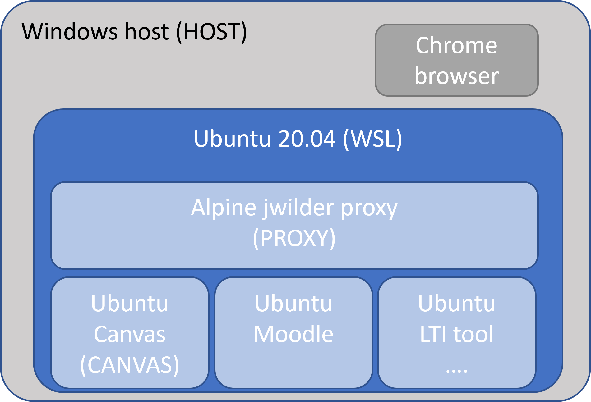
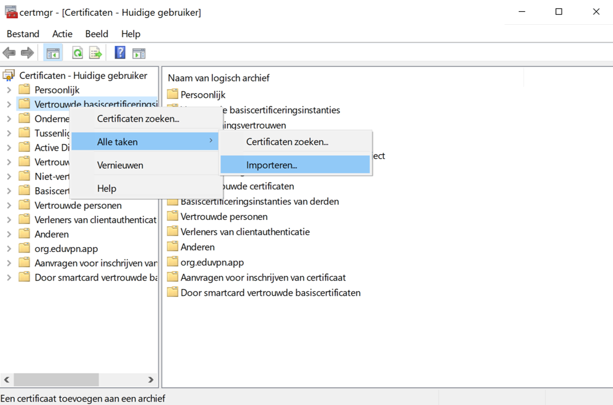

# LTI - SSL test envornment 
-------------------------------

# LTI 1.3

With the introduction of LTI 1.3, starting and using tools in learning environments has become more secure. To achieve optimal testing facilities, the use of proper signing and SSL becomes needed. This repository and it's sub repo's are meant as tools to help developers achieve a production like environment to test their LTI tools.

## proxy information
If you, like me are running several subdomains to test you can use a proxy sollution. This implementation also uses a reverse proxy implementation of the "Jwilder Nginx Reverse Proxy" more information on this can be found at: https://hub.docker.com/r/jwilder/nginx-proxy 
in order for the application to work with a selfsigned certificates we need to take a couple of steps. The repository you are currently viewing helps in setting up this "certificate-environment" for testing purposes

## Prerequisites
Asuming you are working in a windows coding environment with docker tools that you wish to test we need to setup a certificate tree, which we than later can reuse across the different systems. To do so we need to have OpenSSL available on our systems. For example purposes I will be using a local directory in a Ubuntu 20.04 WSL envrironment running on a Windows machine on which the generation of the certificates will take place and form which we than can reuse the certificates across the docker images, the windows host and the Ubuntu WSL.

The example environment we are builing looks like this:

## Set up certificates
Since selfsigned certificates will provide a lot of errors while using them in development we need to come up with a solution that will enable us to use certificates within our own local network. Some great information on this can be found here:

* https://medium.com/@superseb/get-your-certificate-chain-right-4b117a9c0fce
* https://betterprogramming.pub/trusted-self-signed-certificate-and-local-domains-for-testing-7c6e6e3f9548
* https://askubuntu.com/questions/73287/how-do-i-install-a-root-certificate
* https://deliciousbrains.com/ssl-certificate-authority-for-local-https-development/

For our solution we will be taking the following steps:
1. Create your own certificate authority (in our case conducted on the (WSL))
2. Create a wildcard certificate to be used within our local domain
3. Chain the certificates
4. Distribute the certificates to the projects we are setting up

## creating your own certificate authotity
Using OpenSSL it is very easy to setup your own CA. There are only two steps involved in this proces. 

First, we generate our private key:

    openssl genrsa -des3 -out localCA.key 2048

You will be prompted for a passphrase, which step you SHOULD NOT skip and keep safe, we will be needing it a couple of times. The passphrase will prevent anyone who gets your private key from generating a root certificate of their own. You will also be prompted for this passphrase in later steps.

Next, we create our root certificate based on the key we just generated:

    openssl req -x509 -new -nodes -key localCA.key -sha256 -days 1825 -out localCA.pem

Running this code, you will be asked several questions, amongst which the passphrase we just created, I hope you remebered it.

You should now have two files: localCA.key (your private key) and localCA.pem (your root certificate). Ubuntu requires an extra file the localCA.crt in this case. We can simply create this file from our current localCA.pem file by using the following command:

    openssl x509 -in localCA.pem -inform PEM -out localCA.crt

This is a great start we have the root part fixed now we can start working on getting certificates for the different test servers in our local network. We will be doing this by creating a SSL SAN certificate which we can then use on the different servers, by simply renaming it, without having regenerate a new certificate.

## Setting Up the SAN SSL

Generate an SSL SAN Certificate With the Root Certificate
The root certificate is trusted now. Let’s issue an SSL certificate to support our local domains — proxy.example.nl, lti.example.nl, canvas.example.nl, and localhost for testing.
Create a new OpenSSL configuration file server.csr.cnf so the configurations details can be used while generating the certificate. 

    [req]
    default_bits = 2048
    prompt = no
    default_md = sha256
    distinguished_name = dn

    [dn]
    C = NL
    ST = UT
    L = Utrecht
    O = Tech Dep
    OU = Integration Team
    emailAddress = admin@example.nl
    CN = localhost

Create a v3.ext file with a list of local SAN domains:

    authorityKeyIdentifier = keyid,issuer
    basicConstraints = CA:FALSE
    keyUsage = digitalSignature, nonRepudiation, keyEncipherment, dataEncipherment
    subjectAltName = @alt_names
    [alt_names]
    DNS.1 = proxy.example.nl
    DNS.2 = lti.example.nl
    DNS.3 = canvas.example.nl
    DNS.4 = localhost
 
Create a private key and certificate-signing request (CSR) for the localhost certificate.

    openssl req -new -sha256 -nodes -out server.csr -newkey rsa:2048 -keyout server.key -config server.csr.cnf

This private key is stored on server.key.
Let’s issue a certificate via the root SSL certificate and the CSR created earlier.

    openssl x509 -req -in server.csr -CA localCA.pem -CAkey localCA.key -CAcreateserial -out server.crt -days 500 -sha256 -extfile v3.ext

When it says “Enter passphrase for localCA.key,” enter the passphrase used while generating the root key.
The output certificate is stored in a file called server.crt.

We can now remove thhe configuration files

    rm server.csr.cnf v3.ext

## making it all work together (step one true (local)Certificate Authority)
We now Managed to get all our preparations done and are of to world domination (well perphaps we should take smaller stpes local domination in our test network. We have the following files at our disposal:

    certs
      |-localCA.key (your CA private key)
      |-localCA.pem (your CA root certificate)
      |-localCA.crt (your CA root certificate for Ubuntu)
      |-server.crt (your SAN certificate)
      |-server.key (your server private key)

We can now add our CA certificate to the systems where we will be using the SAN certificate (it needs to be installed on all systems connecting to the SAN certificates, the clients and the proxy as well) An easy way of doing this is by mounting the certificate and installing it. On a Ubuntu machine this is done by:

on an alpine and ubuntu system this is done by mounting the certificate into:

    - ./certs/localCA.crt:/usr/local/share/ca-certificates/ca-certificates.crt 

And by running:

    update-ca-certificates

Against the running container. This will give an error on alpine and works perfect under ubuntu (a known issue in alpine and can be caught (2> /dev/null)) but the certificate is now active and available

After adding the CA certificate we can now add the SAN certificates on the servers
We can now rename the certificate we are going to make available through the proxy

    mv server.crt example.nl.crt
    mv server.key example.nl.key

## Add you CA to the local development machine
Remember we will also need to add our trusted CA to the development machine this can be done in windows 10 by taking the following steps:
Open a Command Prompt and run Certificate Manager with the following command:

    certmgr.msc

In the left-hand frame, expand Trusted Root Certificates, and then right-click on Certificates and select All Tasks->Import 

## Clone Repo

# Example for wild card SSL
I also ran across another solution creating a wild card
https://oliverlundquist.com/2018/02/26/setup-ssl-and-https-in-your-local-environment.html 

    openssl req \
        -newkey rsa:2048 \
        -x509 \
        -nodes \
        -keyout ~/Desktop/my-domain.dev.key \
        -new \
        -out ~/Desktop/my-domain.dev.crt \
        -reqexts SAN \
        -extensions SAN \
        -config <(cat /System/Library/OpenSSL/openssl.cnf \
            <(printf '
    [req]
    default_bits = 2048
    prompt = no
    default_md = sha256
    x509_extensions = v3_req
    distinguished_name = dn

    [dn]
    C = JP
    ST = Tokyo
    L = Tokyo
    O = MyDomain Inc.
    OU = Technology Group
    emailAddress = hello@my-domain.jp
    CN = my-domain.dev

    [v3_req]
    authorityKeyIdentifier = keyid,issuer
    basicConstraints = CA:FALSE
    keyUsage = digitalSignature, nonRepudiation, keyEncipherment, dataEncipherment
    subjectAltName = @alt_names

    [SAN]
    subjectAltName = @alt_names

    [alt_names]
    DNS.1 = *.my-domain.dev
    DNS.2 = my-domain.dev
    ')) \
        -sha256 \
        -days 3650